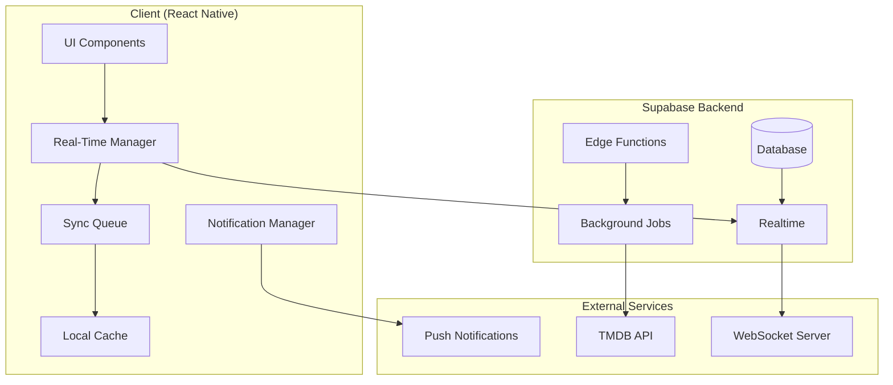
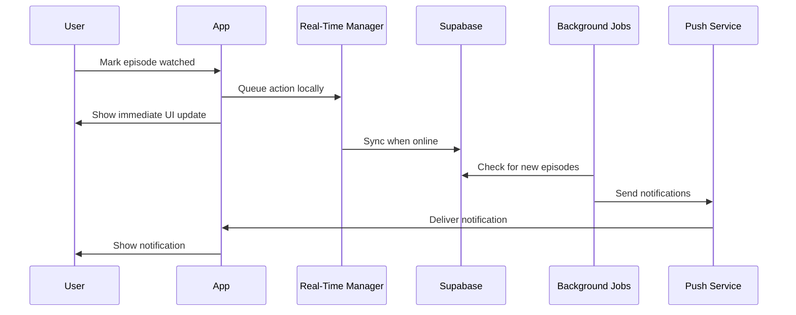

# Real-Time Features & Notifications Design Document

## Overview

This design implements a comprehensive real-time notification system for StreamScribe that maintains the existing offline-first architecture. The system uses a hybrid approach combining WebSocket connections for real-time updates, background jobs for data processing, and push notifications for user engagement, all while ensuring seamless offline functionality with intelligent sync queuing.

## Architecture

### High-Level Architecture



### Real-Time Data Flow



## Components and Interfaces

### 1. Real-Time Manager

**Purpose**: Central coordinator for all real-time functionality, managing WebSocket connections, sync queues, and data consistency.

**Key Responsibilities**:
- Establish and maintain WebSocket connections
- Queue offline actions and sync when online
- Handle real-time updates from Supabase
- Manage connection state and reconnection logic

**Interface**:
```typescript
interface RealTimeManager {
  // Connection Management
  connect(): Promise<void>;
  disconnect(): void;
  isConnected(): boolean;
  
  // Real-time Updates
  subscribeToUserData(userId: string): void;
  subscribeToWatchlistUpdates(userId: string): void;
  subscribeToProgressUpdates(userId: string): void;
  
  // Sync Management
  queueAction(action: SyncAction): void;
  processSyncQueue(): Promise<void>;
  getQueueStatus(): QueueStatus;
  
  // Event Handling
  onUpdate(callback: (update: RealTimeUpdate) => void): void;
  onConnectionChange(callback: (connected: boolean) => void): void;
}
```

### 2. Notification Manager

**Purpose**: Handle all notification-related functionality including push notifications, in-app alerts, and notification preferences.

**Key Responsibilities**:
- Register for push notifications
- Process notification payloads
- Manage notification preferences
- Handle notification interactions

**Interface**:
```typescript
interface NotificationManager {
  // Setup & Permissions
  requestPermissions(): Promise<boolean>;
  registerForPushNotifications(): Promise<string | null>;
  
  // Notification Handling
  scheduleLocalNotification(notification: LocalNotification): void;
  handleNotificationReceived(notification: Notification): void;
  handleNotificationTapped(notification: Notification): void;
  
  // Preferences
  updatePreferences(prefs: NotificationPreferences): Promise<void>;
  getPreferences(): Promise<NotificationPreferences>;
  
  // Testing
  sendTestNotification(): Promise<void>;
}
```

### 3. Background Sync Service

**Purpose**: Manage background data synchronization and processing when the app is not active.

**Key Responsibilities**:
- Process sync queue in background
- Handle background app refresh
- Manage background task lifecycle
- Optimize for battery usage

**Interface**:
```typescript
interface BackgroundSyncService {
  // Background Tasks
  registerBackgroundTask(): void;
  executeBackgroundSync(): Promise<void>;
  
  // Queue Management
  processPendingActions(): Promise<SyncResult>;
  optimizeQueueForBackground(): void;
  
  // Performance
  shouldThrottleSync(): boolean;
  getBackgroundSyncInterval(): number;
}
```

### 4. Episode Tracker

**Purpose**: Monitor and track new episode releases for shows in user watchlists.

**Key Responsibilities**:
- Check for new episodes via TMDB API
- Compare against user watchlists
- Generate episode notifications
- Handle episode metadata updates

**Interface**:
```typescript
interface EpisodeTracker {
  // Episode Monitoring
  checkForNewEpisodes(showIds: number[]): Promise<NewEpisode[]>;
  getUpcomingEpisodes(showIds: number[]): Promise<UpcomingEpisode[]>;
  
  // Notification Generation
  generateEpisodeNotifications(episodes: NewEpisode[]): Promise<Notification[]>;
  shouldNotifyForEpisode(episode: Episode, userPrefs: UserPreferences): boolean;
  
  // Data Management
  updateEpisodeCache(episodes: Episode[]): Promise<void>;
  getEpisodeFromCache(showId: number, season: number, episode: number): Promise<Episode | null>;
}
```

## Data Models

### Real-Time Update Types

```typescript
// Base real-time update structure
interface RealTimeUpdate {
  id: string;
  type: 'progress' | 'watchlist' | 'episode_release' | 'streaming_availability';
  userId: string;
  timestamp: string;
  data: any;
}

// Progress update
interface ProgressUpdate extends RealTimeUpdate {
  type: 'progress';
  data: {
    showId: number;
    seasonNumber: number;
    episodeNumber: number;
    watched: boolean;
    deviceId: string;
  };
}

// Watchlist update
interface WatchlistUpdate extends RealTimeUpdate {
  type: 'watchlist';
  data: {
    action: 'add' | 'remove' | 'update';
    item: WatchlistItem;
  };
}
```

### Notification Types

```typescript
interface NotificationPayload {
  id: string;
  type: 'episode_release' | 'streaming_availability' | 'recommendation' | 'progress_sync';
  title: string;
  body: string;
  data: Record<string, any>;
  scheduledFor?: string;
  priority: 'high' | 'normal' | 'low';
}

interface NotificationPreferences {
  userId: string;
  episodeReleases: boolean;
  streamingUpdates: boolean;
  recommendations: boolean;
  progressSync: boolean;
  quietHours: {
    enabled: boolean;
    start: string; // HH:MM format
    end: string;   // HH:MM format
  };
  frequency: 'immediate' | 'daily' | 'weekly';
  updatedAt: string;
}
```

### Sync Queue Models

```typescript
interface SyncAction {
  id: string;
  type: 'progress_update' | 'watchlist_change' | 'preference_update';
  payload: any;
  timestamp: string;
  retryCount: number;
  deviceId: string;
}

interface QueueStatus {
  pendingActions: number;
  lastSyncTime: string;
  isProcessing: boolean;
  errors: SyncError[];
}

interface SyncResult {
  processed: number;
  failed: number;
  conflicts: ConflictResolution[];
}
```

## Error Handling

### Connection Management

**Offline Handling**:
- Graceful degradation when WebSocket connection fails
- Automatic reconnection with exponential backoff
- Queue all actions locally with optimistic UI updates
- Batch sync when connection restored

**Conflict Resolution**:
- Last-write-wins for most operations
- Special handling for progress conflicts (merge watched episodes)
- Detailed conflict logging for debugging
- User notification for critical conflicts

**Error Recovery**:
```typescript
interface ErrorRecoveryStrategy {
  // Connection Errors
  handleConnectionLoss(): void;
  attemptReconnection(): Promise<boolean>;
  
  // Sync Errors
  handleSyncFailure(action: SyncAction, error: Error): void;
  shouldRetryAction(action: SyncAction): boolean;
  
  // Data Conflicts
  resolveConflict(local: any, remote: any): any;
  logConflict(conflict: DataConflict): void;
}
```

### Notification Error Handling

**Permission Handling**:
- Graceful fallback to in-app notifications
- Periodic re-prompting for permissions
- Clear user communication about notification benefits

**Delivery Failures**:
- Retry logic for failed push notifications
- Fallback to in-app alerts for critical notifications
- Tracking and analytics for notification delivery rates

## Testing Strategy

### Unit Testing

**Real-Time Manager Tests**:
- Connection establishment and maintenance
- Queue management and processing
- Update handling and distribution
- Error scenarios and recovery

**Notification Manager Tests**:
- Permission handling
- Notification scheduling and delivery
- Preference management
- Payload processing

### Integration Testing

**End-to-End Scenarios**:
- Complete offline-to-online sync flow
- Multi-device progress synchronization
- Notification delivery and interaction
- Background processing workflows

**Performance Testing**:
- Large sync queue processing
- Memory usage during real-time updates
- Battery impact measurement
- Network efficiency testing

### Mock Services

```typescript
interface MockRealTimeService {
  simulateConnection(): void;
  simulateDisconnection(): void;
  sendMockUpdate(update: RealTimeUpdate): void;
  simulateNetworkLatency(ms: number): void;
}

interface MockNotificationService {
  simulatePermissionGrant(): void;
  simulatePermissionDeny(): void;
  simulateNotificationTap(payload: NotificationPayload): void;
  simulateBackgroundNotification(): void;
}
```

## Implementation Phases

### Phase 1: Core Real-Time Infrastructure
- Implement Real-Time Manager
- Set up WebSocket connections with Supabase
- Basic sync queue functionality
- Connection state management

### Phase 2: Notification System
- Implement Notification Manager
- Push notification registration and handling
- Basic notification types (episodes, streaming)
- Notification preferences

### Phase 3: Background Processing
- Background sync service
- Episode tracking and monitoring
- Automated notification generation
- Performance optimization

### Phase 4: Advanced Features
- Conflict resolution improvements
- Advanced notification grouping
- Analytics and monitoring
- Performance fine-tuning

## Security Considerations

**Data Privacy**:
- All real-time updates encrypted in transit
- User data isolation in multi-tenant setup
- Minimal data in notification payloads
- Secure token management for push notifications

**Authentication**:
- JWT token validation for WebSocket connections
- Automatic token refresh handling
- Secure storage of notification tokens
- Device-specific authentication

**Rate Limiting**:
- Client-side rate limiting for API calls
- Server-side protection against abuse
- Intelligent batching to reduce requests
- Graceful handling of rate limit errors